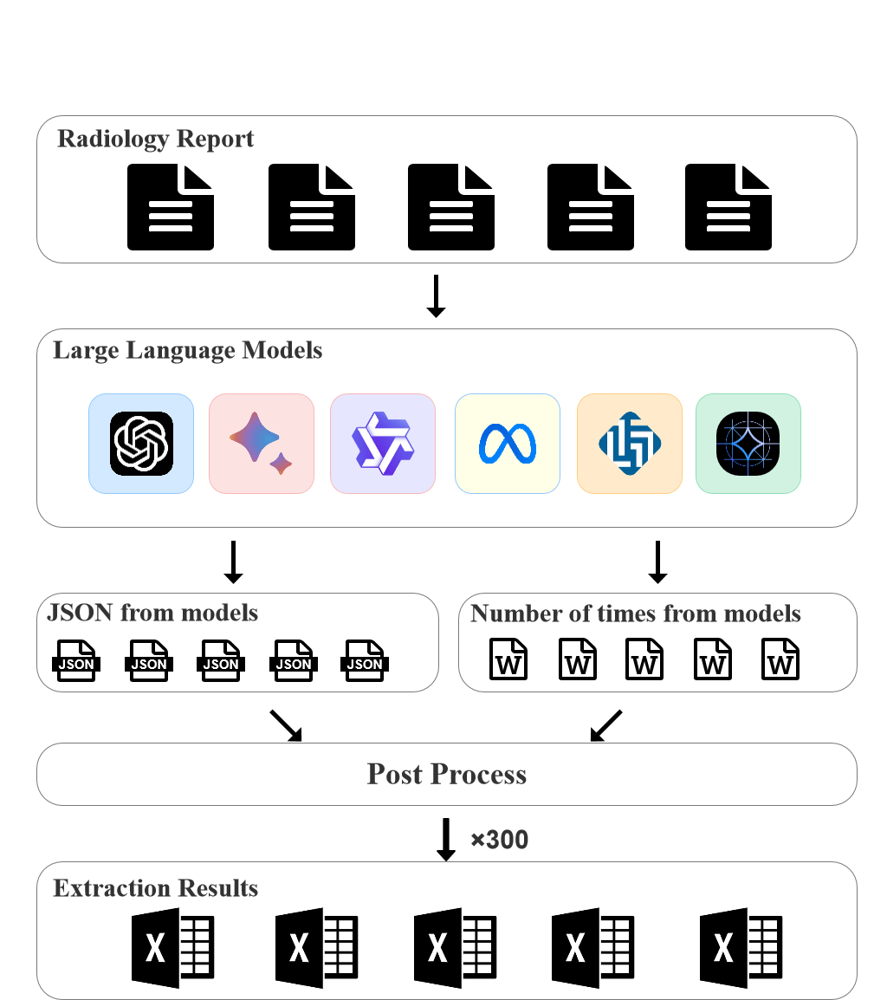

# Bone LLM Code

[](https://doi.org/10.1186/s12913-026-14350-3)
[](https://link.springer.com/article/10.1186/s12913-026-14350-3)

Official code repository for the paper:

**Enhancing bone metastasis CT report analysis: a comparison of local and proprietary large language models for privacy and resource efficiency**  
*BMC Health Services Research* (Published: March 19, 2026)

## Overview

This repository provides inference scripts for structured information extraction from free-text bone metastasis CT reports using large language models (LLMs).

The workflow focuses on three clinically relevant outputs:
- fracture status
- metastasis site
- pathological fracture status

The code supports both proprietary APIs and locally deployable models through an OpenAI-compatible interface, making it suitable for privacy-sensitive clinical environments.

## Paper

- Article page: https://link.springer.com/article/10.1186/s12913-026-14350-3
- DOI: https://doi.org/10.1186/s12913-026-14350-3

## Experimental Workflow

<p align="center">
  
</p>

Figure 2 presents the experimental workflow.

## Repository Structure

- `main.py`: CLI entry point for running model inference on a CT report
- `utils_api.py`: API wrapper, JSON parsing, retry loop, and post-processing helpers
- `Prompt.md`: Chinese system prompt template
- `Prompt_en.md`: English system prompt template

## Quick Start

### 1) Clone

```bash
git clone https://github.com/Becomingw/Bone_LLM_code.git
cd Bone_LLM_code
```

### 2) Install dependency

```bash
pip install openai
```

### 3) Configure API key (recommended)

```bash
export LLM_API_KEY="your_api_key"
```

### 4) Run inference

```bash
python main.py \
  --prompt "Your CT report text" \
  --model "deepseek-chat" \
  --base_url "https://api.deepseek.com" \
  --system_prompt_file "Prompt.md"
```

## CLI Arguments

- `--prompt` (required): report text to be analyzed
- `--model` (optional): model name, default `deepseek-chat`
- `--base_url` (optional): API endpoint, default `https://api.deepseek.com`
- `--api_key` (optional): API key (if omitted, reads `LLM_API_KEY`)
- `--system_prompt_file` (optional): prompt template file, default `Prompt.md`

## Supported Backends (OpenAI-Compatible)

- DeepSeek: `https://api.deepseek.com`
- OpenAI: `https://api.openai.com`
- Gemini (OpenAI-compatible endpoint): `https://generativelanguage.googleapis.com/v1beta/openai/`
- Ollama (local deployment): `http://localhost:11434`

## Example

```bash
python main.py \
  --prompt "Left 7th and 9th posterior ribs show bone destruction with progression, suggestive of metastasis. Multiple bilateral rib post-fracture changes." \
  --model "gemini-1.5-pro" \
  --base_url "https://generativelanguage.googleapis.com/v1beta/openai/" \
  --api_key "YOUR_API_KEY" \
  --system_prompt_file "Prompt_en.md"
```

Expected output is a tuple-like result containing:
- fracture status
- metastasis site
- pathological fracture status

## Data Availability and Privacy

This repository contains code only. Clinical data are not public due to patient privacy and institutional restrictions. Please refer to the published article for the official data-availability statement.

## Citation

If this repository contributes to your work, please cite:

```text
Li Z, Wang M, Liu A, Zeng Y, Yan B, Cao Z, Zhu J, Yang Y, Li Y.
Enhancing bone metastasis CT report analysis: a comparison of local and proprietary large language models for privacy and resource efficiency.
BMC Health Services Research. 2026.
https://doi.org/10.1186/s12913-026-14350-3
```

BibTeX:

```bibtex
@article{li2026bone,
  title   = {Enhancing bone metastasis CT report analysis: a comparison of local and proprietary large language models for privacy and resource efficiency},
  author  = {Li, Zhuo and Wang, Mengfei and Liu, Ao and Zeng, Yao and Yan, Bicong and Cao, Zhongzheng and Zhu, Jinyu and Yang, Yulu and Li, Yuehua},
  journal = {BMC Health Services Research},
  year    = {2026},
  doi     = {10.1186/s12913-026-14350-3},
  url     = {https://doi.org/10.1186/s12913-026-14350-3}
}
```

## Acknowledgments

This implementation uses OpenAI-compatible API calling patterns and draws on the ecosystems of OpenAI, DeepSeek, Gemini, Ollama, and llama.cpp.

## License

No license file is currently included in this repository. Please contact the repository owner for reuse permissions.
